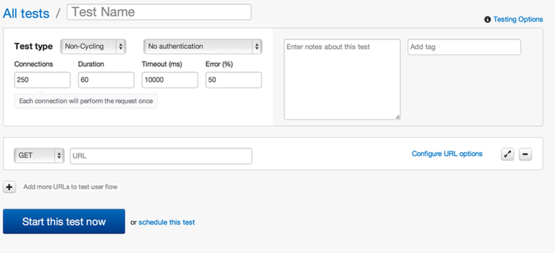

# Creating a Test

There are two ways to create a new test:

- [from scratch](#from-scratch)
- [cloning an existing test](#cloning)

---------------------

## A new test from scratch <a href="#from-scratch" id="from-scratch" class="mark">#</a>

When you click on the "new test" button, you are presented with a form with several inputs for your new test:

What do all of these fields mean? Glad you asked...

### Test Name <a href="#test-name" id="test-name" class="mark">#</a>

This one is for you: give your test a name so you can find it later. Or leave it blank and the test's URL will be used as the name. This can be changed later.

### Test Type <a href="#test-type" id="test-type" class="mark">#</a>

In a cycling test, loader.io's load generator will "cycle" requests, re-using a connection for the duration of the test and making as many requests as it possibly can in that time. Non-Cycling tests do not re-use connections for multiple tests, and make only the number of connections specified in the test.

Cycling vs. Non-Cycling tests are discussed in more detail in [test types](test-types.html).

### Authentication <a href="#authentication" id="authentication" class="mark">#</a>

Loader.io supports HTTP [basic access authentication][wp-basic-auth]. If you need this, select "Basic authentication" from the dropdown and enter your username and password.

**Be careful with this!!** Authentication details are stored unencrypted on our servers, because if we encrypted them, we wouldn't be able to use them during the test. We recommend creating a test user for use with loader.io if you need to test against an authenticated server.

### Connections & Duration <a href="#connections-and-duration" id="connections-and-duration" class="mark">#</a>

These are the main settings for your test: how many connections should we make, and how long should the test run?

Specifying the number of connections depends on the test type.

- **non-cycling test**: there is just one field: "Connections". Whatever number you enter here is the number of connections that will be made to your server.

- **cycling test**: there is a "from" and a "to" field. Cycling tests start with some number of connections ("from") and can increase the connections throughout the test, reaching the number in the "to" field by the end of the test.

The **duration** field means the same in both cases: the amount of time to run the test, in seconds.

### Timeout & Error (%) <a href="#timeout-and-error" id="timeout-and-error" class="mark">#</a>

The **timeout** field allows you to specify the amount of time the Loader.io load generators will wait for a response from your app before counting a request as a timeout error. The default is 10,000 miliseconds (10 seconds).

The **error** field is an error threshold for the test. If your app reaches the error percentage threshold, the test will be aborted.

### Notes & Tags <a href="#notes-and-tags" id="notes-and-tags" class="mark">#</a>

The **notes** and **tag** fields are for you: write a description of the test, server configuration, or whatever you want. Add a tag to help you organize your tests. We don't look at these fields, we just save 'em for you :)

### URLs & Options <a href="#urls-and-options" id="urls-and-options" class="mark">#</a>

At the most basic level, all you need to do with the URL field is enter the URL you want to test. The default is to do a simple HTTP GET request to that URL. Click on "Configure URL Options" to get fancy:

- **HTTP Headers**: if your app needs special [HTTP headers][wp-headers] to be sent, you can specify them here. The header name (e.g. `Content-Type`) goes in the left box, and the value (e.g. `application/json`) in the right box. Click the "+" button to add more.
- **GET Options**: You can add key/value pairs in these input boxes, and they will be URL-encoded and added to the query string of your URL.
- **POST Options**: You can add either key/value pairs in the key/value boxes, just like with GET Options. These will be encoded and sent in the request body, the same as if a user filled out a form and submitted it. You can also provide the raw body text by selecting "BODY" and typing in the text area.
- **Payload File**: You can use a specially-formatted JSON file to pass varying data on each request. Craft your [payload file][payload-file], put it at a public URL, and enter that URL in the box labeled "Enter the URL". When you run the test, loader.io will download the file, parse it, and use the data in the request body. See [payload files][payload-file] for more details on the format.

---------------------

## Cloning tests <a href="#cloning" id="cloning" class="mark">#</a>

After a test runs and you look at the [results][results], you may want to tweak one setting, bump the connections up (or down) for example, and run it again. Rather than fill out the entire form again, just clone the test, adjust the settings as needed, and re-run. Cloning a test is nothing more than taking an old test and pre-filling the new test form with the old test's settings for you.

There are two ways to clone a test: the big "clone" button on the results page, and a (semi-secretive) clone mini-button on the main test listing page (hover the mouse over the test to reveal the buttons):

[wp-basic-auth]: https://en.wikipedia.org/wiki/Basic_access_authentication "HTTP Basic Access Authentication"
[wp-headers]: https://en.wikipedia.org/wiki/HTTP_headers "HTTP Headers"
[payload-file]: payload-files.html "Payload File"
[results]: results.html "Test Results"

