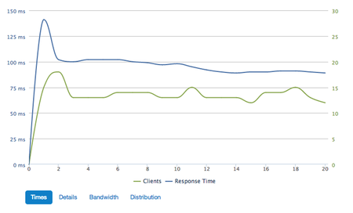
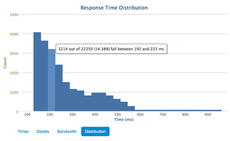

# Test Results

So you've created your test, verified it, run it, and watched the results come in real-time on a niftly little graph. What does it all mean? Let's break down the results page.

## Summary data <a href="#summary-data" id="summary-data" class="mark">#</a>

This section shows you a basic summary of the test:

- **Date & Time**: when the test ran
- **Max clients**: the maximum number of connections that were made
- **Duration**: the duration of the test
- **Success Responses**: total number of successful responses (`1xx`, `2xx`, or `3xx` response codes)
- **Avg Time**: Average time loader waited for a response from your app
- **Rcvd by clients**: Total amount of data we received from your app (response size)
- **Sent from clients**: Total amount of data we sent to your app (request size)
- **Timeout errors**: Requests that did not receive a response within the configured [timeout][timeout]
- **Network Errors**: DNS resolution, TCP connection timeouts, resets, and other transport-layer problems
- **Errors (400/500)**: Responses returned with an error code (`4xx` and `5xx` response codes)
- **Avg error rate**: Percentage of errors out of the total attempted requests

## Graphs <a href="#graphs" id="graphs" class="mark">#</a>

There are three graphs that give more detailed information about what is going on during the test: *response times*, *error rates*, and *bandwidth*. On each graph, you can show or hide different parts of the chart by clicking on the label in the key below the graph.

### Times <a href="#graphs-response-times" id="graphs-response-times" class="mark">#</a>

The response times graph displays two lines:

- **in green**: the number of connections that were made to your app
- **in blue**: the average response time for the connections made

If you look closely, you will also notice that this graph has two vertical axes as well: response time on the left, connections on the right. Don't mix them up!

### Details <a href="#graphs-error-rates" id="graphs-error-rates" class="mark">#</a>

The error rates graph is a slight misnomer; it actually displays success rates as well as errors. The idea here though is to give you an idea about when your app begins to throw errors, when requests start timing out, and so on. If you see only green on this graph, your app is doing well. When it turns yellow, orange, or red then you have some performance tuning (or debugging!) to do :)

### Bandwidth <a href="#graphs-bandwidth" id="graphs-bandwidth" class="mark">#</a>

This graph just shows how much data was sent from your app, and how much your app received from loader.io. Pretty straightforward!

### Distribution <a href="#graphs-distribution" id="graphs-distribution" class="mark">#</a>

For <a href="http://loader.io/pricing">pro users</a> we display a histogram of response times. We group similar response times together into buckets and display them as bars on the histogram. This type of graph shows more information about how your servers are performing than the averages on the other graphs. Here you can see where the majority of your responses lie in relation to the minimum, average, and maximum response times.

For example in the histogram pictured here, the minimum response time was 131ms and the max was 940ms. The histogram shows that very few responses took longer than 600ms.

## All Results <a href="#all-results" id="all-results" class="mark">#</a>

When you run a test several times (use the "re-run" button!), you see the most recent results by default. You can access results from previous runs by clicking the "All Results" tab above the graphs. The All Results tab displays a table of vital statistics from each run, and a link to view the details. The result you are currently looking at is highlighted in blue.

[timeout]: creating.html#timeout-and-error
