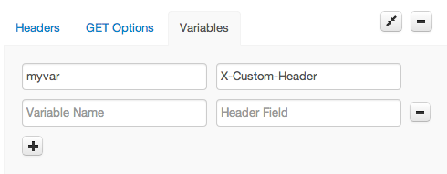
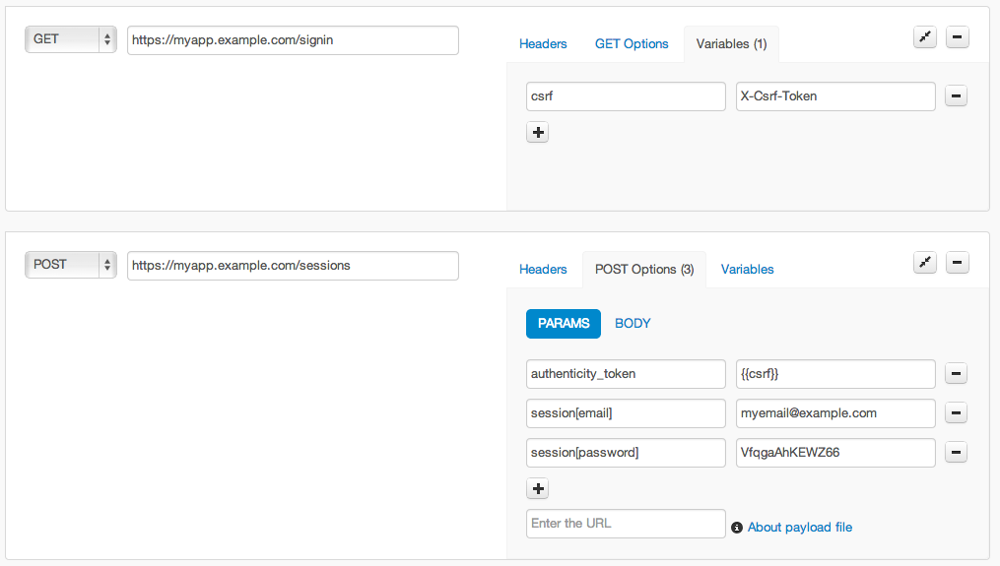

# Variables

Variables allow you to create test URLs that use data from a previous HTTP
response header in your test. Specify variables by clicking on "Configure URL options"
when creating a new test and then click the "Variables" link.

Define a variable by specifying a name and an HTTP response header field name.

A variable name must only contain alphanumeric ASCII characters and the underscore.
Variable names are case sensitive.

Once you have defined a variable, you can use that variable in any subsequent
URL in that test using the `{{varname}}` syntax. For example, if you defined
a variable named *id*, you could specify a test URL that used *id* in the path:

    http://mysite.example.com/products/{{id}}/details

You can also use variables in GET Options and POST Options. For example, you
could define a variable called *csrf* that was associated with a header field
called `X-Csrf-Token`, and then pass it as a POST Option.

