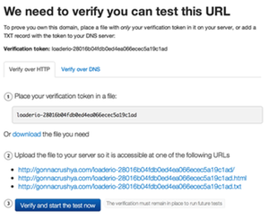

# Verifying an App

Before starting a test, loader.io needs to verify that you are the owner of the domain you are testing. When your app is created, a token is generated for it, which will look something like this:

    loaderio-28016b04fdb0ed4ea066ecec5a19c1ad

The numbers and letters after `loaderio-` are your app's token. You will need to use this token to verify your app. There are two ways to verify your app: by [uploading a file][http] to your server, or [adding a TXT record][dns] to your DNS.

Once your verification is in place and Loader checks it, your tests can run. If you ever remove the verification, tests will not be able to run.

Tokens are unique for each user and each app, so even if another user tries to test your app, your verification file will not work for them- they will not be able to verify it, unless they have access to upload their own verification file or alter your DNS records.

--------------

## Verify by HTTP <a href="#http" id="http" class="mark">#</a>

To verify your app via HTTP, place your app token in a file and upload it to a root directory on your server. To make this easy, a link is provided on the verification page for you to download a file with the correct name and contents.

When you click "verify and start the test now", Loader will check for the verification file and run the test if the verification succeeds. Loader will check for the verification file each time you run a test on the same domain.

- The file's name should be `loaderio-[your token]` with an optional `.txt` or `.html` extension

      loaderio-28016b04fdb0ed4ea066ecec5a19c1ad.txt

- The only text in the file should be `loaderio-` and the token itself

      $ cat loaderio-28016b04fdb0ed4ea066ecec5a19c1ad.txt
      loaderio-28016b04fdb0ed4ea066ecec5a19c1ad

- The file should be uploaded at the root of your server

      http://gonnacrushya.com/loaderio-28016b04fdb0ed4ea066ecec5a19c1ad.txt

--------------

## Verify by DNS <a href="#dns" id="dns" class="mark">#</a>

To verify your domain by DNS, you will need to add a [TXT record][wp-txt] for your app's domain. How you do this depends on your hosting provider and how you are hosting your DNS, so if you aren't sure how to add a TXT record, check your hosting provider's documentation, or search the web.

- Create a TXT record with the value `loaderio=[your token]`
- If the app you are testing is a subdomain (e.g. `appname.gonnacrushya.com`), the TXT record can be on either the subdomain or the root domain
- It can take time for your DNS changes to [propagate][wp-propagate], so [don't panic][wm-towelday] if DNS verification fails at first

[http]: #http "Verify by HTTP"
[dns]: #dns "Verify by DNS"
[wp-txt]: http://en.wikipedia.org/wiki/List_of_DNS_record_types#TXT "DNS Record Types"
[wp-propagate]: http://en.wikipedia.org/wiki/Domain_Name_System#Record_caching "DNS Record Caching"
[wm-towelday]: http://upload.wikimedia.org/wikipedia/commons/1/17/Towelday-Innsbruck.jpg "Towel Day"

